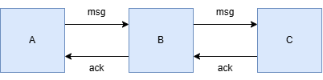

# DECT NR+ Relay System

This repository contains all the relevant file for building a simple A -> B -> C relay system. The only files not contained in this repository are the build files.

### How the Relay Functions

The most basic idea of the relay is to send data from A to C through the intermediate board B. This idea can be expanded to include more "B" boards to cover a longer distance.



To begin, we first start by setting a unique device id for each board which can be defined in the prj.conf file. This is how each board knows who is sending messages. Next, we define two types of messages: acknowledgments and message. These two parameters, device id and message type, are necessary for each board to determine if what they are recieving is meant for them.

Each board sends a packet with the same structure as seen below.

 * Frame layout (all frames):
 *   Byte 0:   type                 (MSG_DATA or MSG_ACK)
 *   Byte 1:   seq                  (# for data packet. 1, 2, 3 ...)
 *   Byte 2:   sender_id high byte
 *   Byte 3:   sender_id low byte
 *   Byte 4+:  payload              (MSG_DATA only)
  
We send message type, seq or message number, sender id, and then the message data itself.

### Board A:

Board A begins by attemping to send messsage 0 to board B. Immediatly after sending, the board will enter a recieve mode. If an acknowledgment is recieved from board B then board A will attempt to send message 1. If now acknowledgement is recieved, then board A will transmit message 0 again, wait for acknowledgement, and continue until an ackowledgement is successful.

### Board B: 

Board B begins in recieve mode and listens for message sent by A. Once a message is recieved then an ackowledgement is sent back to A. Now, board B will forward the message to board C. At this time board B will enter a similar state as board A where it will continously send the message until is recieves acknowledgment from C. 

It is important to note that until board B recieves an acknowledgement from C, it will not listen for any message from board A, hence board A will continouslly transmit for example message 1 until board B knows that board C recieved message 0.

### Board C

Board C is the simplest as it only listens for message from board B and sends and acknowledgment back to B once it has recieved message data.

### Note On on_pdc() Function

When any packet is "heard" by a board, it first goes through the on_pdc() function (pdc = physical data channel) before it is technically received. This function gives us the ability to determine if a board was suppose to recieve this data or it should decline the message. 

Below is an example of the on_pdc() function as implemented for board A. After checking the frame length, we begin by seperation the incoming frame into its 4 components: type, seq, sender id, and data. 

Since board A will only ever recieve acknowledgement, we check if the message type is acknowledgement. Then we do another check to ensure determine if sender B is who sent the acknowledgment. Only then do we give back acknowledgment semaphore. 

In the nested while loop of the main() we have a check which determines if we can take the acknowledgement sempahore. We can only take the semaphore if it has been given (1 state) and if a take or give is successful a 0 is returned which enables us to enter the if statement on line 335.

```C
static void on_pdc(const struct nrf_modem_dect_phy_pdc_event *evt)
{
    if (evt->len < FRAME_HDR_LEN) {
        LOG_WRN("A: Frame too short (%d bytes), ignoring", evt->len);
        return;
    }

    const uint8_t *data = (const uint8_t *)evt->data;
    uint8_t  type      = data[0];
    uint8_t  seq       = data[1];
    uint16_t sender_id = ((uint16_t)data[2] << 8) | data[3];

    if (type == MSG_ACK) {
        if (sender_id != DEVICE_ID_B) {
            LOG_WRN("A: ACK from unexpected sender %d, ignoring", sender_id);
            return;
        }
        LOG_INF("A: ACK from B for seq %d", seq);
        k_sem_give(&ack_sem);
    } else {
        LOG_WRN("A: Unexpected frame type 0x%02x from sender %d", type, sender_id);
    }
}

```

### Sending with 915MHz channel

The current code has been adjusted for the 915MHz channel

If you need to alter another design for this channel here are teh instructions: First, you should go into the prj.conf file and change the following

```
CONFIG_CARRIER=530
CONFIG_TX_POWER=19
```

Next, you will need to go into the Kconfig and enable a higher transmit power.

```
config TX_POWER
	int "TX power"
	range 0 19
	default 19
	help
	   Transmission power, max 19 dBm due to hardware limitations.
	   See table 6.2.1-3 of ETSI TS 103 636-4 v1.5.1.
```

After rebuilding you should be set for operation on the 915MHz channel which greatly increased the range.